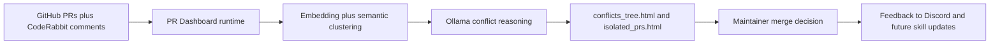
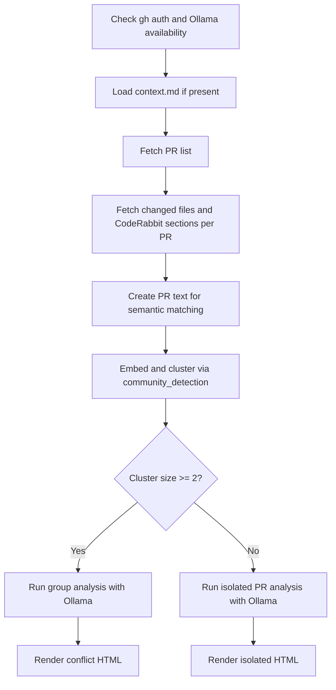
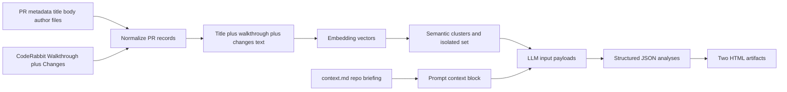
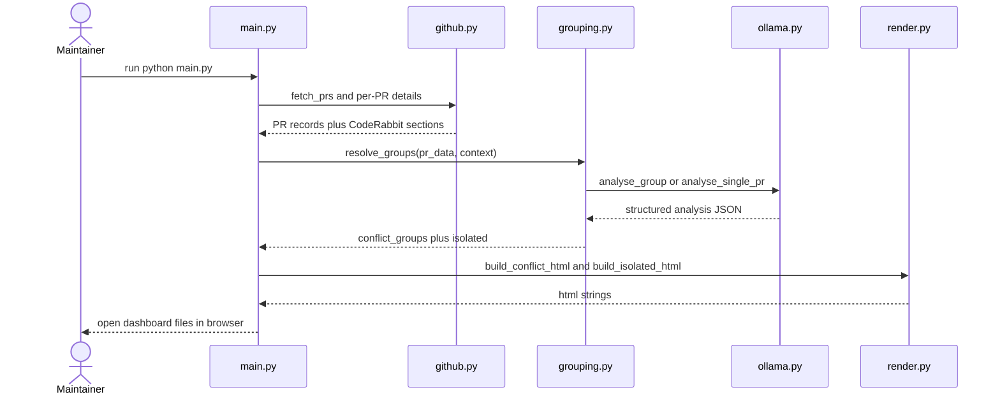
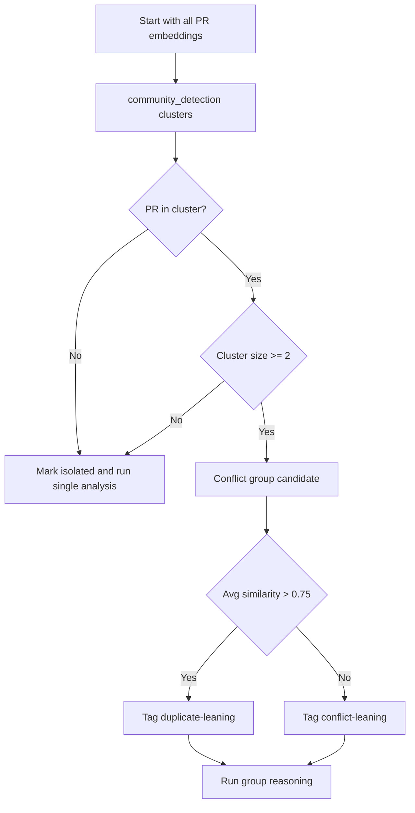
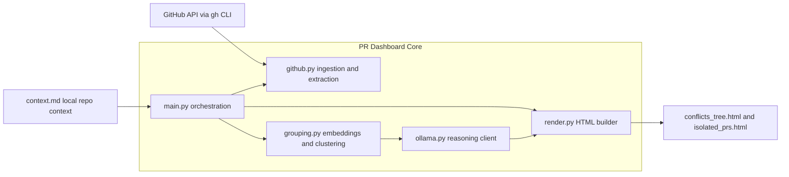
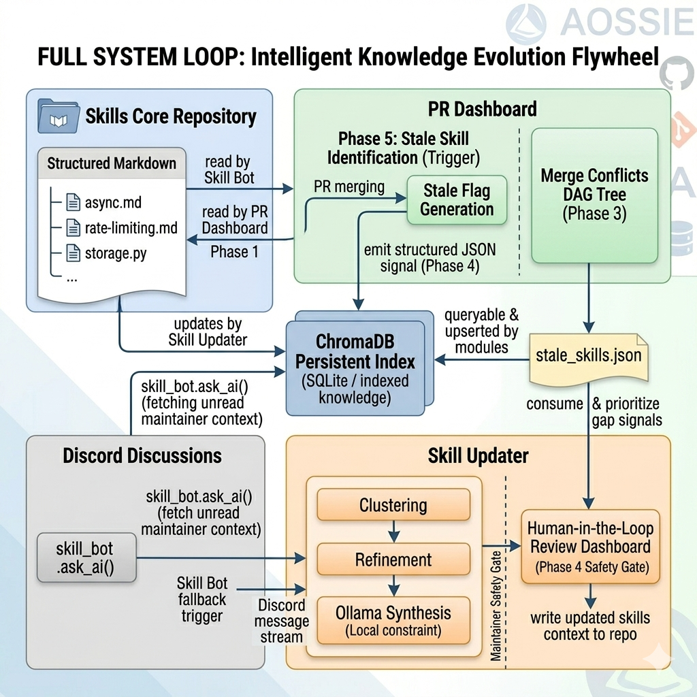

# PR Dashboard MVP overview

Summary of the current PR Dashboard MVP in this repository.

This is written as a system-module view (not as an isolated app):

- PR Dashboard analyzes pull requests and produces merge guidance.
- It consumes repository context now (`context.md`), and is designed to consume Skills Core context in the larger system.
- It outputs maintainer-facing conflict and isolated PR dashboards.

Reading guide:

- Each box is an action plus expected output.
- Diagrams are intentionally compact for proposal readability.
- Description blocks explain exactly what each diagram is showing.

---

## 1) End-to-End MVP (System Fit)

Description:

- Shows where this module sits in the full contributor-to-maintainer loop.
- Emphasizes MVP value: transform noisy PR streams into decision-ready outputs.
- Keeps the final actor clear: maintainer decides merge order.

---

## 2) Internal Pipeline (Code-Level Flow)

Description:

- Matches the actual execution path in `main.py`, `grouping.py`, `ollama.py`, and `render.py`.
- Highlights the hard branch where PRs become either conflict groups or isolated cards.
- Distinguishes deterministic stages from LLM reasoning stages.

---

## 3) Data Flow (Inputs to Outputs)

Description:

- Focuses on information movement, not function call order.
- Shows where context is injected and where structure is recovered from LLM output.
- Clarifies why output is operationally useful: structured analysis rendered as dashboards.

---

## 4) Runtime Sequence (Interaction by Module)

Description:

- Shows call ownership and boundaries between modules.
- Makes external dependency points explicit: GitHub CLI and Ollama API paths.
- Useful for debugging and onboarding.

---

## 5) Decision Logic (Conflict vs Isolated)

Description:

- Captures classification rules currently used in MVP.
- Makes clear that similarity labels are heuristic in v1 and refined by LLM reasoning.
- Useful as a bridge to roadmap Phase 3 (NLI precision layer).

---

## 6) Component Architecture (Current Boundaries)

Description:

- Shows module responsibilities and data handoff boundaries.
- Highlights that MVP is local-first and file-output oriented.
- Useful for identifying where to add cache, validation, and scheduling.

---

## 7) Integration View (Org-Level Interaction)

Description:

- Positions PR Dashboard within the full multi-module system.
- Shows current and target integration paths clearly in one compact view.
- Captures the feedback loop that keeps system knowledge fresh.

---

## 8) Key MVP Notes

1. Current context source is local `context.md`; roadmap target is Skills Core retrieval.
2. Semantic grouping is embedding-based (`all-MiniLM-L6-v2`) and local.
3. Conflict explanation and merge-order guidance are produced by local Ollama models.
4. Output is intentionally maintainer-facing HTML, not automatic merge actions.
5. MVP is local-first: no cloud LLM dependency and no mandatory data exfiltration.
6. Best next precision upgrade is NLI pair classification before DAG labeling.
