# AOSSIE PR Dashboard — ROADMAP

> **Module:** PR Dashboard (Maintainer Decision System)
> **Role in System:** Consumes Skills Core → assists maintainers in merge decisions → flags stale skills to Skill Updater
> **Design Constraint:** Local-first (Ollama + sentence-transformers), Git-backed, semantic-summary-over-code

---

## Current State (v1 — Deterministic Foundation)

The existing pipeline is intentionally simple and auditable:

```
GitHub CLI → CodeRabbit summary extraction → sentence-transformers embedding
→ community_detection() clustering → Ollama LLM (per group/isolated PR)
→ conflicts_tree.html + isolated_prs.html
```

**What works well:**
- Semantic clustering via `all-MiniLM-L6-v2` avoids raw code diffing
- CodeRabbit-only extraction removes noise (no poems, tips, sequence diagrams)
- Fully local — zero cloud API calls, zero data exfiltration
- `context.md` injection gives Ollama repo-specific grounding
- Two-output render: conflict DAG tree + safe-to-merge isolated PRs

### POC Demonstrations

The following screenshots show the full run from extraction to maintainer-facing outputs.

1. **CodeRabbit summary quality gate**

    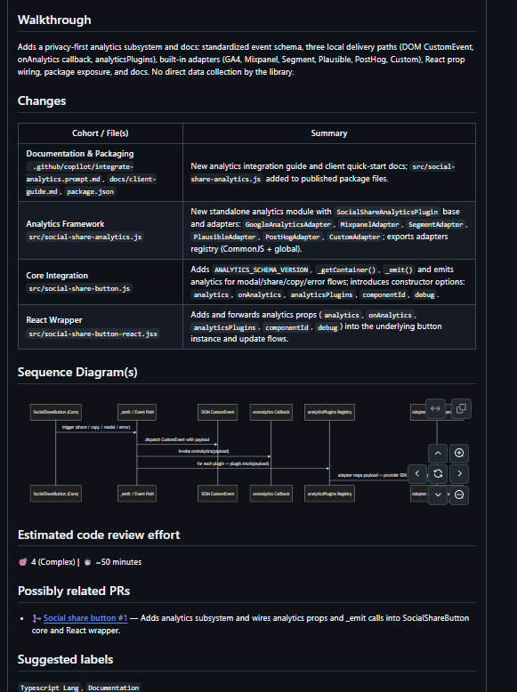

    The input text being consumed is structured around walkthrough and changed files. This keeps noisy conversational content out and preserves decision-relevant signals before embedding.

2.  **Terminal run: grouped + isolated analysis workflow**

    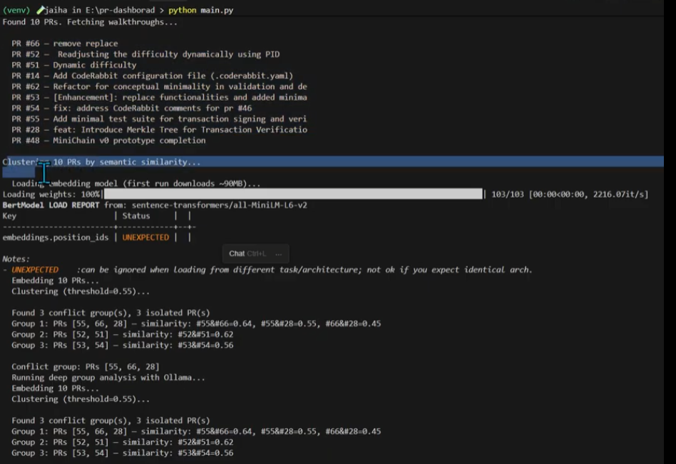

    After grouping, the system runs deeper Ollama reasoning per group and per isolated PR,

3. **Terminal run: ingestion, embedding, and clustering**

    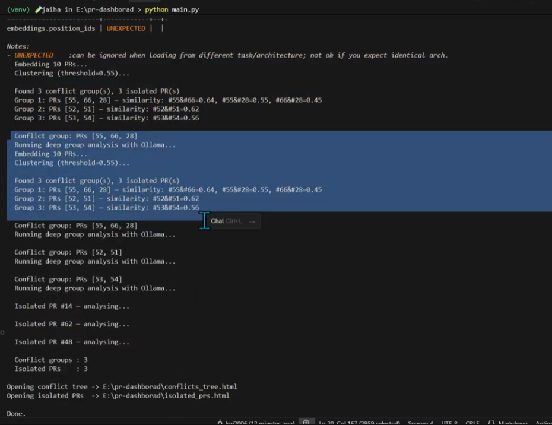

    The run starts by fetching PR walkthroughs, loading `all-MiniLM-L6-v2`, embedding each PR summary, and grouping semantically related PRs using the configured threshold.
 then writes two artifacts: `conflicts_tree.html` and `isolated_prs.html`.

4. **Conflict DAG view with merge reasoning**

    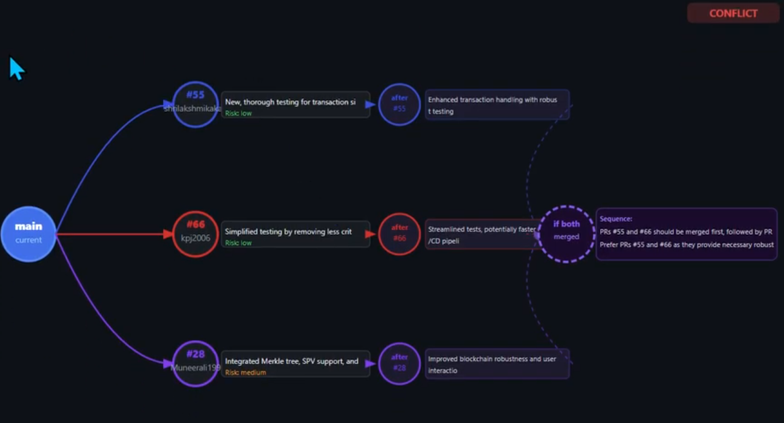

    The visual DAG maps current branch state to multiple PR paths, shows each path's likely post-merge state, and provides an explicit recommended sequence when combined outcomes differ.

5. **Conflict card view with problem framing and shared direction**

    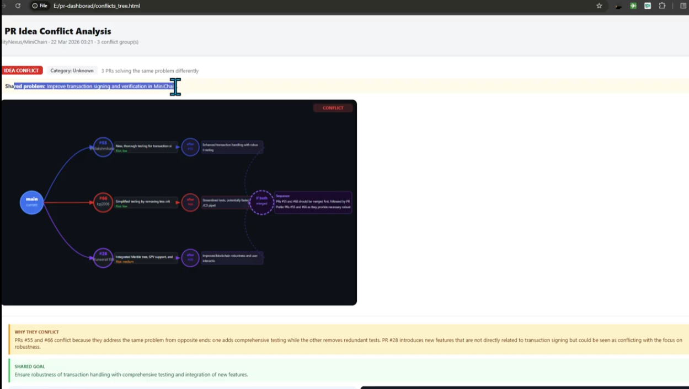

    This panel explains why proposals collide, where their intent overlaps, and how to move forward without losing important work from parallel approaches.

6. **Readable multi-card conflict comparison for maintainers**

    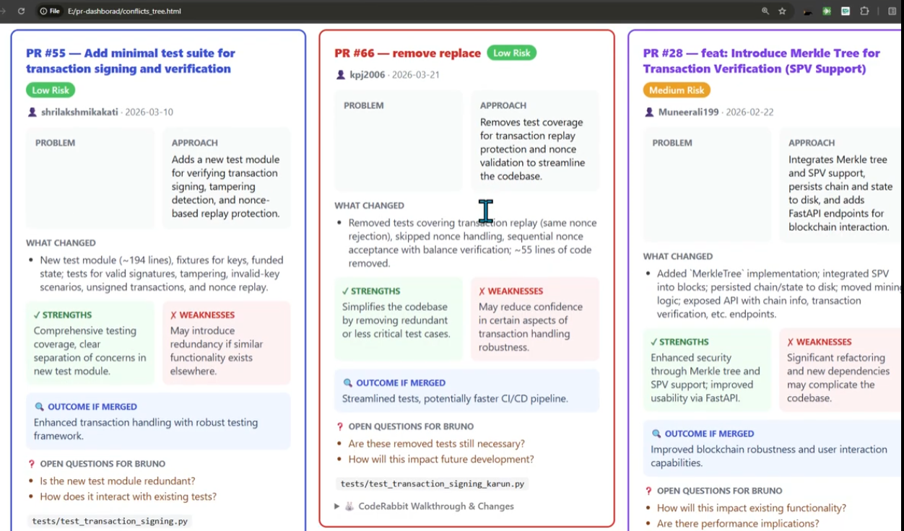

    Side-by-side cards make author intent, trade-offs, and likely project impact easy to compare quickly during decision meetings. 

7. **Isolated PR view for safe parallel merges**

    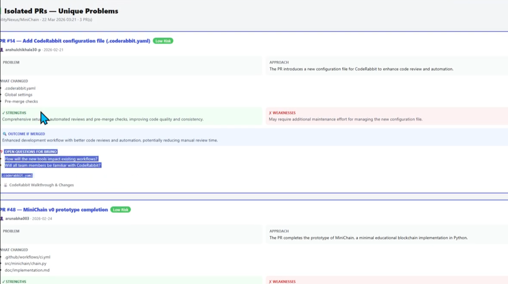

    Independent PRs are shown as separate cards with concise impact summaries, review prompts, and expected outcomes so maintainers can merge low-risk work without waiting on conflict-heavy threads.

**Tutorial**:https://youtu.be/h5Vv0vE19X4

**Current limitations which covers in this roadmap:**

- `context.md` is manually written — not sourced from Skills Core
- No Discord context injected (maintainer discussions ignored) only repo knowledge from `context.md` with coderabbit summaries.
- NLI pair labeling is missing — cosine threshold is imprecise
- No staleness signal sent back to Skill Updater
- No GitHub comment integration — analysis stays local only
- Manual CLI trigger — no automation or scheduling
- Single-repo only — no cross-repo PR intelligence

---

## Phase 0 — Stability Hardening (Current Sprint)

**Goal:** Make v1 production-safe before adding intelligence layers.

**Tasks:**

- [ ] Handle PRs with no CodeRabbit comment gracefully with a time limit — fallback to PR body + title
- [ ] Retry logic for Ollama calls (currently crashes on timeout)
- [ ] Persistent run cache — skip re-embedding PRs already processed in last N hours
- [ ] Switch production default from `state=closed` (testing) to `state=open`
- [ ] Structured output validation — Ollama JSON responses parsed through Pydantic models

```python
# PR embedding cache — avoid re-embedding known PRs
cache = {}  # {pr_number: embedding_vector}

def get_pr_embedding(pr_number, summary_text):
    if pr_number not in cache:
        cache[pr_number] = embed(summary_text)
    return cache[pr_number]
```

```python
# Pydantic model for Ollama response validation
from pydantic import BaseModel
from typing import List, Optional

class PRAnalysis(BaseModel):
    conflict_reason: str
    merge_order: List[int]
    preferred_pr: int
    reasoning: str
    open_questions: Optional[List[str]]
```

---

## Phase 1 — Skills Core Integration

> **System alignment:** Skills Core is the central context layer. PR Dashboard currently uses a manually written `context.md`. This phase replaces that with live Skills Core data — making the dashboard context-aware and always up to date.

**Goal:** Replace static `context.md` with dynamic Skills Core injection, giving Ollama structured, maintainer-validated repository knowledge.

**Current flow:**
```
context.md (manual) → prepended to every Ollama prompt
```

**New flow:**
```
Skills Core skill files → embedded at startup → top-k retrieved per PR cluster
→ injected as structured context into Ollama prompt
```

**Implementation:**

```python
import chromadb
from glob import glob

# Index Skills Core at startup
client = chromadb.PersistentClient(path="./chroma_skills")
collection = client.get_or_create_collection("skills_context")

for skill_file in glob("skills/**/*.md"):
    content = open(skill_file).read()
    embedding = embed(content)
    collection.upsert(
        ids=[skill_file],
        embeddings=[embedding],
        documents=[content],
        metadatas={"path": skill_file, "type": extract_type(skill_file)}
    )

# Per PR cluster — retrieve relevant skill files
def get_skill_context(cluster_summary: str) -> str:
    results = collection.query(
        query_embeddings=[embed(cluster_summary)],
        n_results=3
    )
    return "\n\n".join(results["documents"][0])
```

**Prompt injection pattern:**

```python
prompt = f"""
## Repository Skill Context (structured, maintainer-validated)
{skill_context}

## PR Conflict Group
{pr_group_summary}

Analyze the conflict, recommend merge order, identify the best approach.
"""
```

**Why this matters for the system:**

The Skills Core contains architecture decisions, edge cases, and workflow constraints that `context.md` never had. Injecting it makes Ollama conflict reasoning grounded in validated knowledge — not guesswork.

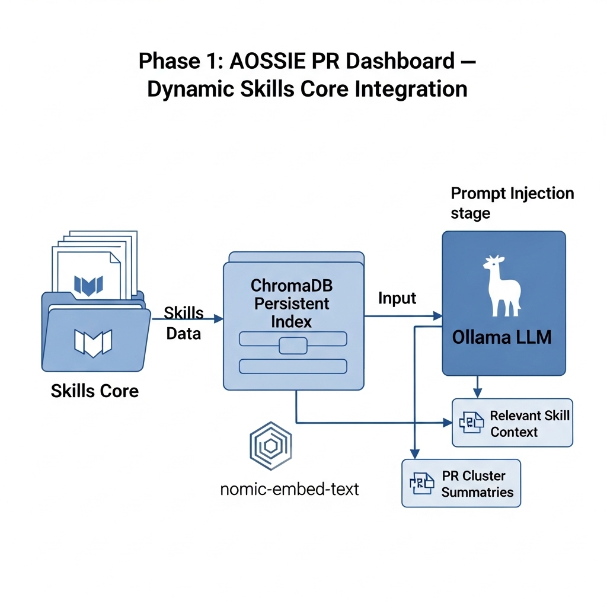
---

## Phase 2 — Discord Context Injection

> **System alignment:** Skill Bot fetches Discord discussions. Skill Updater mines them for knowledge. PR Dashboard should also consume them for deeper conflict reasoning — especially for PRs where the maintainer has already discussed intent in Discord.

**Goal:** Fetch unread maintainer Discord messages and match them to open PRs — injecting relevant discussion context into Ollama's conflict analysis.

**Reference:** Roadmap item already noted in current README (`fetch all unread messages from discord`), aligned with [skill-bot-ask-ai](https://github.com/kpj2006/skill-bot-ask-ai-).

**Flow:**

```
Discord REST API → filter maintainer messages → embed messages
→ cosine match against PR cluster embedding → inject top-k into Ollama prompt
```

**Implementation:**

```python
import requests

DISCORD_TOKEN = "..."
GUILD_ID = "..."

def fetch_maintainer_messages(channel_id, maintainer_role_id):
    msgs = requests.get(
        f"https://discord.com/api/v10/channels/{channel_id}/messages?limit=100",
        headers={"Authorization": f"Bot {DISCORD_TOKEN}"}
    ).json()
    return [
        m for m in msgs
        if any(r["id"] == maintainer_role_id for r in m.get("member", {}).get("roles", []))
    ]

def match_discord_to_cluster(cluster_embedding, discord_msgs):
    scored = [
        (msg, cosine_sim(cluster_embedding, embed(msg["content"])))
        for msg in discord_msgs
    ]
    return [msg for msg, score in sorted(scored, key=lambda x: -x[1]) if score > 0.5][:3]
```

**Prompt injection:**

```python
prompt = f"""
## Maintainer Discord Discussions (relevant to this PR group)
{discord_context}

## Skills Core Context
{skill_context}

## PR Conflict Group
{pr_group_summary}
"""
```

**Why this matters for the system:**

Maintainers often resolve intent in Discord before a PR is even reviewed. Injecting that discussion closes the gap between "what the code says" and "what the maintainer actually wants."

* see a tutorial of API usage of discord: https://www.youtube.com/shorts/J2v2EvsXbAc

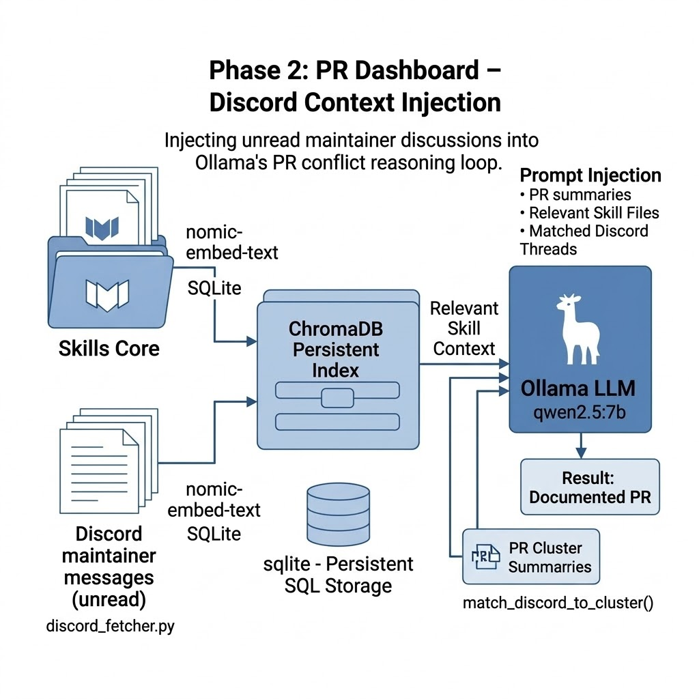
---

## Phase 3 — NLI Precision Layer

> **System alignment:** Current cosine threshold clustering (`THRESHOLD = 0.55`) is a blunt instrument. The Skill Updater uses BERTopic for semantic clustering of Discord messages. PR Dashboard needs an equivalent precision layer for PR pair classification.

**Goal:** Add a Natural Language Inference (NLI) cross-encoder to classify each PR pair as `duplicate / conflict / isolated` with higher precision than cosine similarity alone.

**Model:** `cross-encoder/nli-deberta-v3-small` (~180MB, CPU-compatible)

>same as we are doing in Skill Updater for Discord message clustering, we will use a cross-encoder NLI model to classify PR pairs that exceed the cosine similarity threshold. This adds a critical precision layer — distinguishing true conflicts from false positives.

**Current flow:**
```
cosine_similarity > threshold → "conflict group"
```

**New flow:**
```
cosine_similarity > threshold → candidate pairs
→ NLI cross-encoder → labeled: duplicate / conflict / independent
→ conflict DAG only contains NLI-confirmed pairs
```

**Implementation:**

```python
from sentence_transformers import CrossEncoder

nli_model = CrossEncoder("cross-encoder/nli-deberta-v3-small")

LABELS = ["contradiction", "entailment", "neutral"]
# contradiction → conflict
# entailment    → duplicate
# neutral       → independent (remove from conflict group)

def classify_pair(pr_a_summary: str, pr_b_summary: str) -> str:
    scores = nli_model.predict([(pr_a_summary, pr_b_summary)])
    label = LABELS[scores.argmax()]
    return {
        "contradiction": "conflict",
        "entailment": "duplicate",
        "neutral": "independent"
    }[label]
```

**Effect on output:**

| Before NLI | After NLI |
|---|---|
| PR #56 and #61 in same cluster (cosine > 0.55) | PR #56 vs #61: `conflict` (different wiring, same feature) |
| PR #52 and #51 in same cluster | PR #52 vs #51: `duplicate` (same approach, different author) |
| False positives from high cosine on unrelated topic | Filtered out as `independent` |

**Render update:** `conflicts_tree.html` DAG now shows edge labels — `CONFLICT` (red) vs `DUPLICATE` (purple) — based on NLI output, not just cluster membership.

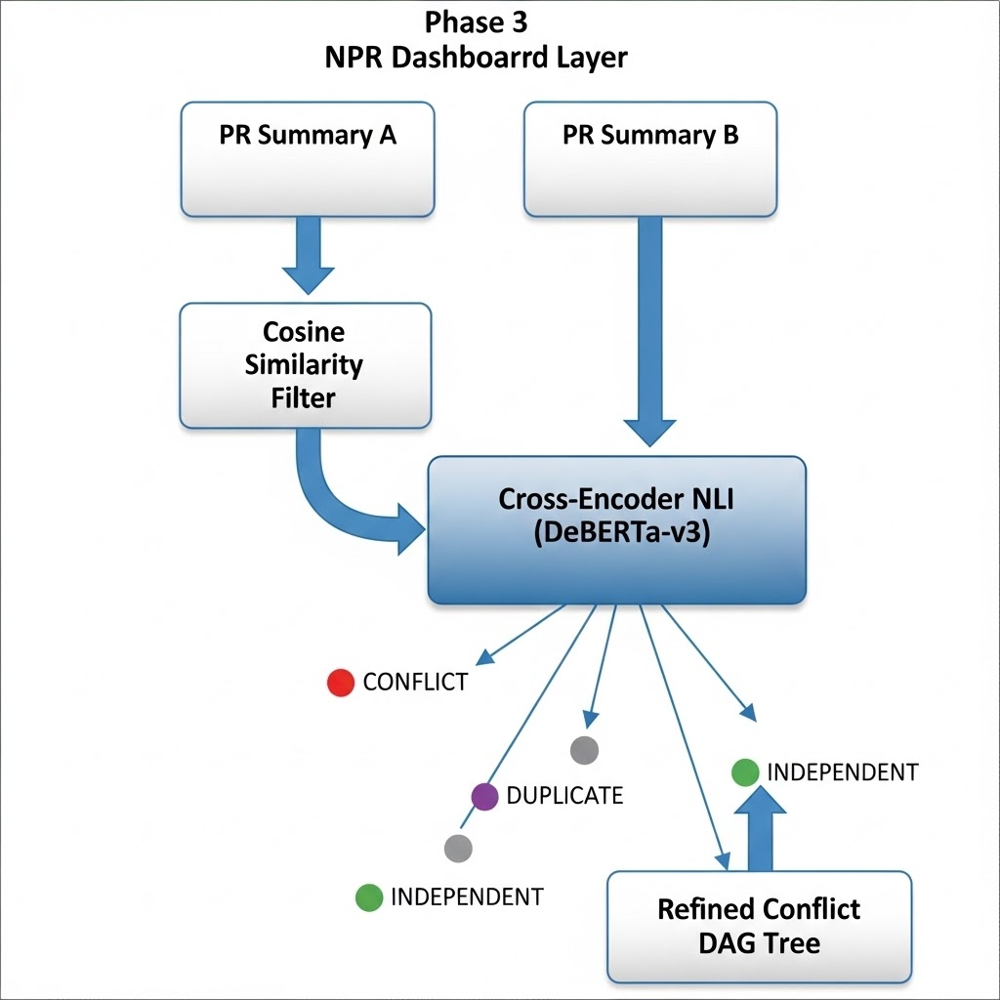

---

## Phase 4 — Stale Skill Detection + Skill Updater Signal

> **System alignment:** This is the critical feedback loop. When a PR is merged that changes a feature, the corresponding skill file in Skills Core may become outdated. PR Dashboard is positioned to detect this and emit a flag to the Skill Updater — completing the full system loop.

**Goal:** After PR analysis, detect when merged PRs semantically overlap with existing skill files. Emit a structured staleness signal to Skill Updater.

**Flow:**

```
PR merged (webhook or CLI poll) → embed PR's CodeRabbit summary
→ ChromaDB query against Skills Core collection
→ cosine distance > threshold → skill file flagged as "potentially outdated"
→ write to stale_skills.json → Skill Updater reads and prioritizes updates
```

**Implementation:**

```python
STALE_THRESHOLD = 0.75  # High similarity = same topic = likely outdated

def detect_stale_skills(merged_pr_summary: str, pr_number: int):
    embedding = embed(merged_pr_summary)
    results = collection.query(query_embeddings=[embedding], n_results=3)

    stale_flags = []
    for skill_path, distance in zip(results["ids"][0], results["distances"][0]):
        similarity = 1 - distance
        if similarity > STALE_THRESHOLD:
            stale_flags.append({
                "skill_file": skill_path,
                "pr_number": pr_number,
                "similarity": round(similarity, 3),
                "reason": f"PR #{pr_number} likely changes content covered by this skill file"
            })

    if stale_flags:
        with open("stale_skills.json", "a") as f:
            json.dump(stale_flags, f)
            f.write("\n")
```

**Skill Updater consumes this:**

```python
# In skill_updater — Phase 5 of its roadmap
stale = load_stale_skills()  # read stale_skills.json from PR Dashboard

# Prioritize Discord message search around these skill file topics
for flag in stale:
    search_discord_for_updates(flag["skill_file"])
```

**This completes the system loop:**

```
PR merged (PR Dashboard)
    → detects stale skill file
    → emits signal to Skill Updater
        → Skill Updater searches Discord for maintainer discussion
        → updates Skills Core
            → Skill Bot gives better answers
            → PR Dashboard gets better context next cycle
```
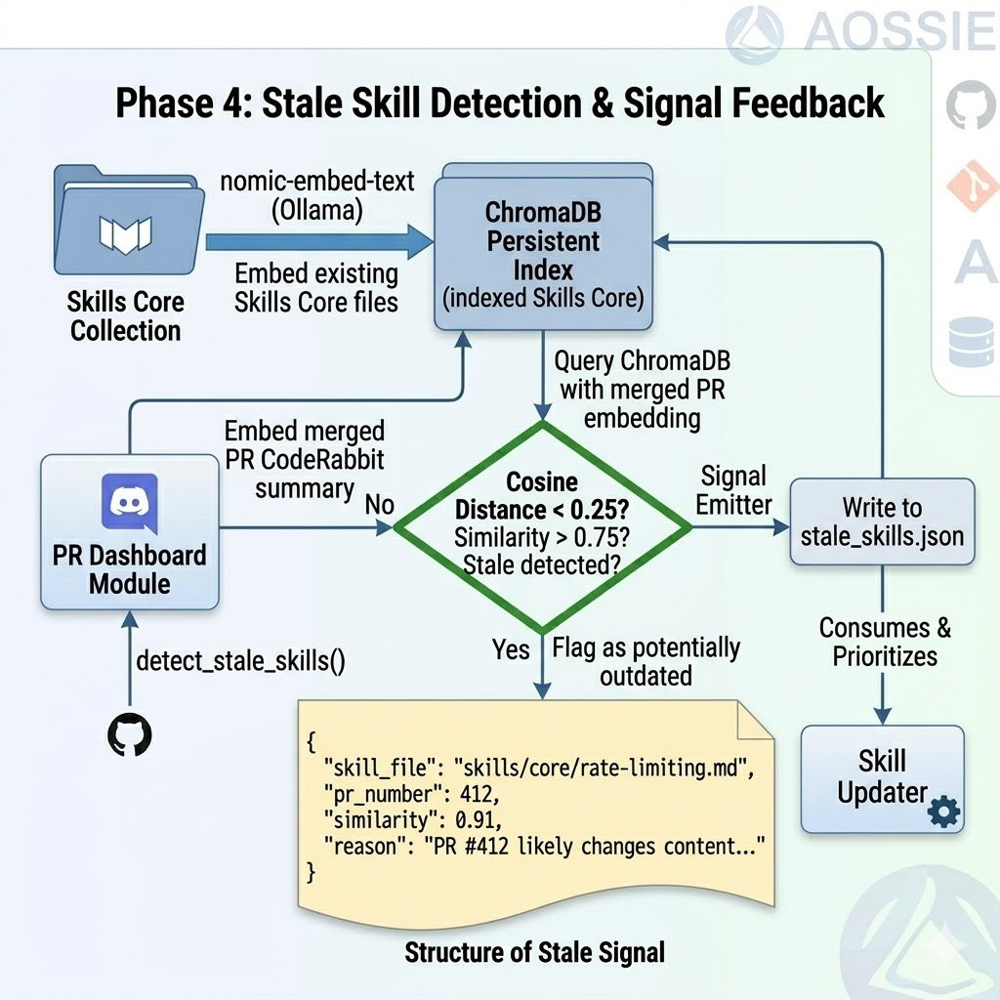
---

## Phase 5 — Merge Order Export + GitHub Integration

> **System alignment:** Analysis stays trapped locally today. To be useful at AOSSIE scale, the merge order and conflict reasoning must be surfaced where maintainers already work — GitHub PR comments and a structured export.

**Goal:** Export merge recommendations as a structured `merge_order.md` and optionally post analysis as GitHub PR comments.

**Sub-task A: merge_order.md export**

```markdown
# Recommended Merge Order — 2025-07-18

## Conflict Group 1: Persistence Layer
1. PR #61 — persistence via SQLite (preferred: cleaner abstraction)
2. PR #56 — persistence via JSON files (superseded if #61 merges first)

**Conflict reason:** Both modify `storage.py`. #61 introduces SQLite schema that conflicts
with #56's JSON file path assumptions. Merge #61 first, then request #56 author to rebase.

## Safe to Merge (no conflicts)
- PR #48 — documentation update
- PR #63 — CI fix
```

**Sub-task B: GitHub PR comment integration (optional, off by default)**

```python
import subprocess

def post_pr_comment(repo: str, pr_number: int, body: str):
    subprocess.run([
        "gh", "pr", "comment", str(pr_number),
        "--repo", repo,
        "--body", body
    ])

# Only triggered if --post-comments flag passed
if args.post_comments:
    for pr_num, analysis in isolated_analyses.items():
        post_pr_comment(REPO, pr_num, format_comment(analysis))
```

**Design constraint:** GitHub comment posting is always opt-in via CLI flag. Default behavior stays local — no data leaves the machine unless maintainer explicitly requests it.

---

## Phase 6 — Multi-Repo Intelligence + AOSSIE Scale

> **System alignment:** AOSSIE manages 300+ repositories. Skills Core is shared across repos via submodules. PR Dashboard must scale accordingly — detecting cross-repo PR conflicts where two repos change shared infrastructure.

**Goal:** Run PR Dashboard across multiple repos simultaneously, using a shared ChromaDB skill index, and detect cross-repo conflicts via shared Skills Core submodule content.

**Architecture:**

```python
REPOS = [
    "AOSSIE/CarbonFootprint",
    "AOSSIE/Agora-Blockchain",
    "AOSSIE/MiniChain",
    # ... up to 300+ repos
]

# Shared ChromaDB across all repos
client = chromadb.PersistentClient(path="./chroma_multi_repo")
collection = client.get_or_create_collection("all_prs")

for repo in REPOS:
    prs = fetch_prs(repo)
    for pr in prs:
        embedding = embed(pr["coderabbit_summary"])
        collection.upsert(
            ids=[f"{repo}#{pr['number']}"],
            embeddings=[embedding],
            documents=[pr["coderabbit_summary"]],
            metadatas={"repo": repo, "pr_number": pr["number"]}
        )

# Cross-repo conflict detection
def find_cross_repo_conflicts(new_pr_embedding, source_repo):
    results = collection.query(
        query_embeddings=[new_pr_embedding],
        n_results=5,
        where={"repo": {"$ne": source_repo}}  # exclude same repo
    )
    return results
```

**Output:** Extended `conflicts_tree.html` that shows cross-repo edges — e.g., "PR #12 in CarbonFootprint conflicts with PR #8 in Agora-Blockchain because both modify shared rate-limit infrastructure."

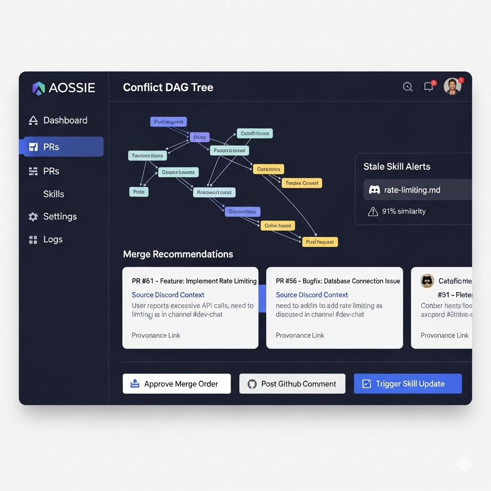
---

## Phase 7 — Human-in-the-Loop Review Interface

> **System alignment:** Mirrors Phase 4 of the Skill Updater roadmap (Human-in-the-Loop Review Dashboard). Same design philosophy — maintainer must approve before any action is taken.

**Goal:** Replace static HTML output files with an interactive FastAPI + HTMX dashboard where maintainers can approve merge recommendations, post GitHub comments, and trigger Skill Updater staleness reviews — all from one interface.

**Architecture:**

```
PR Dashboard analysis → writes to pending_reviews.json
↓
FastAPI + HTMX web dashboard (localhost:8000)
↓
Maintainer sees:
  - [Conflict DAG view]
  - [Merge order recommendation]
  - [Source Discord messages for context]
  - [Skill files that may be stale]
  [Approve merge order] [Post GitHub comment] [Flag for Skill Updater] [Dismiss]
↓
Approved → writes merge_order.md + optional GitHub PR comment
Skill Updater flag → appends to stale_skills.json
```

**Key design decisions (aligned with Skill Updater Phase 4):**
- Dashboard is **read/write only for recommendations** — no direct GitHub merging
- Every recommendation traces back to source PR + Discord messages (full provenance)
- Dismissal reasons logged → used to improve Ollama prompts in next iteration
- Shares the same FastAPI server as Skill Updater's review dashboard (single unified maintainer UI)

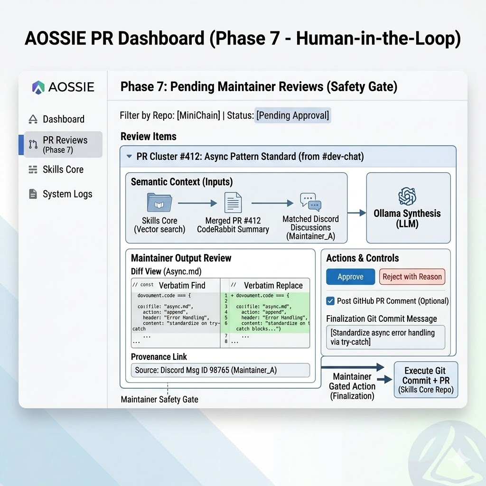
---

## Technology Stack Summary

| Component | Current | Roadmap Addition |
|---|---|---|
| Embeddings | `all-MiniLM-L6-v2` (sentence-transformers) | Same — shared with Skill Updater's nomic-embed-text stack |
| Clustering | `community_detection()` (cosine threshold) | NLI cross-encoder (Phase 3) + ChromaDB ANN (Phase 2) |
| Skill context | Manual `context.md` | Skills Core ChromaDB index (Phase 1) |
| Discord context | None | Maintainer message matching (Phase 2) |
| PR labeling | Binary (grouped / isolated) | `duplicate / conflict / independent` via NLI (Phase 3) |
| Staleness signal | None | `stale_skills.json` emitted to Skill Updater (Phase 4) |
| Output | Two static HTML files | Static HTML + `merge_order.md` + optional GitHub comments (Phase 5) |
| Scale | Single repo | Multi-repo ChromaDB (Phase 6) |
| Review UX | None | Unified FastAPI + HTMX dashboard (Phase 7) |
| LLM | `qwen2.5:7b` via Ollama | Same — no cloud dependency |
| Scheduling | Manual CLI trigger | GitHub Actions cron / n8n workflow |

---

## System Relationship Map (Full Loop)

```
┌─────────────────────────────────────────────────────────────────┐
│                        FULL SYSTEM LOOP                          │
├─────────────────────────────────────────────────────────────────┤
│                                                                  │
│  Skills Core ──────────────────────────────────────────────┐    │
│      ↑ written by Skill Updater                            │    │
│      │ read by Skill Bot                                   ▼    │
│      │ read by PR Dashboard ←──── Phase 1 (this roadmap)       │
│      │                                                          │
│  PR Dashboard                                                    │
│      → detects merged PRs that change features                  │
│      → emits stale_skills.json ──────────────────────────────► │
│                                          Skill Updater          │
│                                              → searches Discord  │
│                                              → updates Skills    │
│                                                Core ────────────┘│
│                                                                  │
│  Discord discussions                                             │
│      → consumed by Skill Updater (knowledge)                    │
│      → consumed by PR Dashboard (PR conflict context)           │
│      → consumed by Skill Bot (Q&A)                              │
│                                                                  │
└─────────────────────────────────────────────────────────────────┘
```

---

## Key Design Principles (Non-Negotiable)

1. **Skills-first context** — Skills Core always injected before LLM reasoning, not after
2. **Semantic summaries over code** — operate on CodeRabbit summaries, never raw diffs
3. **Local-first** — no OpenAI/Anthropic API calls, no data leaves the machine by default
4. **Maintainer-gated action** — recommendations only; no auto-merging, no auto-posting
5. **Provenance** — every analysis traces to source PRs + Discord messages + skill files
6. **Signal emitter** — PR Dashboard actively feeds back to Skill Updater, not passive consumer
7. **Incremental, not batch** — new PRs extend the analysis, never trigger full re-run


## References

- [sentence-transformers community_detection](https://www.sbert.net/docs/package_reference/util.html) — current clustering method
- [cross-encoder/nli-deberta-v3-small](https://huggingface.co/cross-encoder/nli-deberta-v3-small) — NLI pair classification (Phase 3)
- [ChromaDB persistent client](https://docs.trychroma.com/reference/py-client) — multi-repo skill index (Phase 1, 6)
- [Skill Updater Roadmap](../skill-updater/ROADMAP.md) — sibling module, shared design principles
- [RepoAgent](https://github.com/OpenBMB/RepoAgent) — LLM-powered doc update with Git change detection
- [BERTopic Online Learning](https://maartengr.github.io/BERTopic/getting_started/online/online.html) — clustering reference (used in Skill Updater Phase 1)
- [skill-bot-ask-ai Discord fetch pattern](https://github.com/kpj2006/skill-bot-ask-ai-) — Discord REST pattern for Phase 2